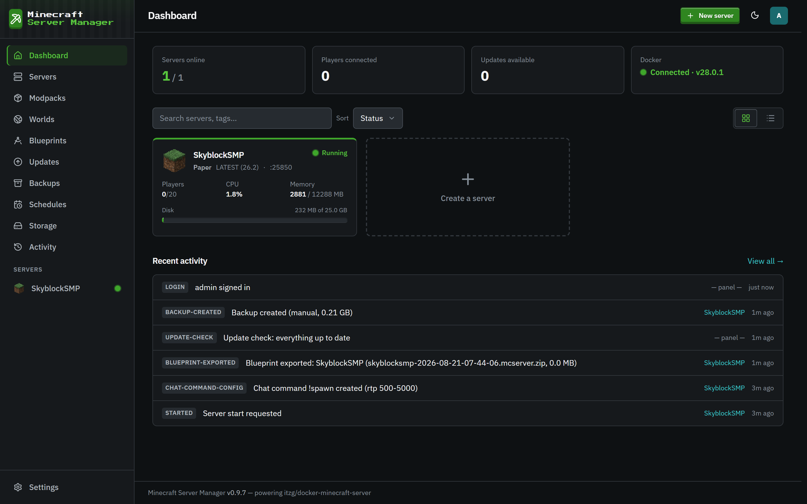

# Minecraft Server Manager Documentation

A complete, self-hosted control panel for [itzg/docker-minecraft-server](https://github.com/itzg/docker-minecraft-server). Create, run, and manage Minecraft servers from your browser. No command line, no editing YAML by hand.

## Start here

- **[Getting started](getting-started.md)**: first-run setup, signing in, and finding your way around.
- **[The dashboard](dashboard.md)**: the at-a-glance view of every server, players, and activity.

## Running servers

- **[Creating & managing servers](servers.md)**: the creation wizard, server types, versions, and per-server settings.
- **[Console & chat commands](console-and-chat.md)**: the live console, and custom in-game chat commands that run as the player.
- **[Modpacks](modpacks.md)**: install CurseForge, Modrinth, FTB, and GT New Horizons packs, always pinned to an exact version.
- **[Worlds & files](worlds-and-files.md)**: swap worlds, manage mods, and edit files directly in the browser.
- **[Shrinking a world](world-shrink.md)**: reclaim disk space by removing chunks nobody visits, on its own or as part of a backup.

## Data & automation

- **[Per-server chatbot](chatbot.md)**: local/OpenAI-compatible conversation, outreach, retained transcripts, and constrained gameplay powers.
- **[Backups](backups.md)**: one-click snapshots, scheduled backups, and restore.
- **[Blueprints](blueprints.md)**: capture a server's whole configuration and stamp out new ones from it.
- **[Schedules](schedules.md)**: cron-driven restarts, backups, and commands.
- **[Storage](storage.md)**: per-server disk usage and panel-enforced quotas.
- **[Updates](updates.md)**: track new server, pack, image, and mod versions, check which Minecraft versions your mods support, and undo a mod update.
- **[Activity log](activity.md)**: an audit trail of everything that happened.
- **[Integrations](integrations.md)**: Discord webhook notifications and the Alerts category.
- **[Public API](public-api.md)**: a read-only, token-authenticated HTTP API for fetching server status from outside the panel.

## Accounts & security

- **[Users & roles](users-and-roles.md)**: admin, operator, and viewer, and what each can do.
- **[Two-factor authentication](two-factor-authentication.md)**: protect your login with an authenticator app.

## Guides

Not specific to this panel: the questions every Minecraft server owner runs into.

- **[How much RAM does a server need?](guide-server-memory.md)**: the two numbers to set, and why an idle server reads as 12 GB.
- **[Vanilla, Paper, Fabric, Forge, NeoForge, Quilt](guide-choosing-a-loader.md)**: which to run, and the plugin/mod difference behind the choice.
- **[Your server will not start](guide-server-wont-start.md)**: reading the log, and the handful of causes behind most failures.
- **[Backups that actually restore](guide-backups.md)**: consistent copies, what else to keep, and testing one before you need it.
- **[Moving a server to another host](guide-moving-a-server.md)**: the order that keeps downtime short and inventories intact.

## Under the hood

- **[Architecture](architecture.md)**: how the panel is put together.

---

> Screenshots in these docs are taken in the panel's dark theme. The panel starts dark unless your OS prefers light; use the theme toggle in the top bar to switch.
