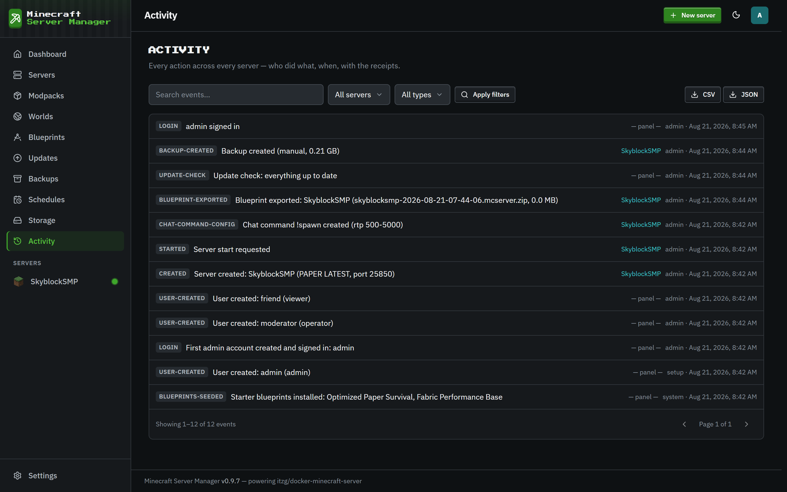

# Activity log

[← Back to docs index](README.md)

The **Activity** page is the full audit trail: a searchable, chronological record of everything that happened in the panel.

## What's recorded

- **Auth**: sign-ins (including whether 2FA or a backup code was used), and 2FA being enabled, disabled, or reset.
- **Server lifecycle**: creates, starts, stops, restarts, crashes, and out-of-memory events.
- **Alerts**: stalled boots, stop failures, failed schedules, quota stops, unhealthy containers, offline-after-restart.
- **Data**: backups created and restored, blueprints exported, pack installs and upgrades.
- **Configuration**: chat-command changes, role changes, and settings edits.

Each entry records who did it (a username, or the panel/scheduler for automated actions), which server it relates to, and when. The [dashboard](dashboard.md) shows the most recent entries; this page is the complete history. Lifecycle and alert events can also be forwarded to Discord (see [Integrations](integrations.md)).

Because it captures security-relevant events (logins, 2FA changes, role changes), the activity log is also your first stop if something looks off with an account.
