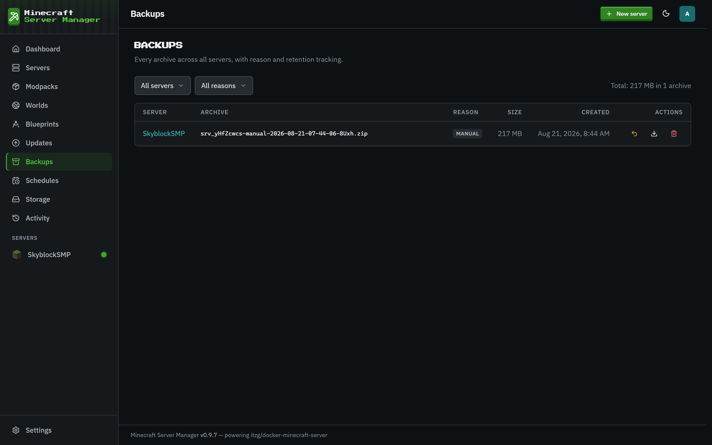
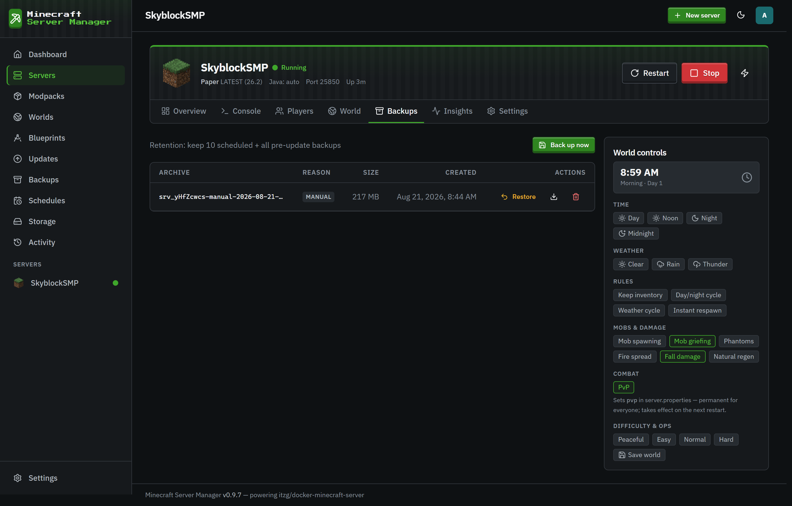

# Backups

[← Back to docs index](README.md)

The **Backups** page is every snapshot across your fleet, with size, reason, and age.

## Creating a backup

From a server's **Backups** tab (or via a [schedule](schedules.md)) you can snapshot the whole server directory in one click. The panel quiesces the world first (`save-off` → `save-all`), zips the data, then re-enables saving (`save-on`), so backups are consistent even on a running server. Compression runs in a background worker thread so it doesn't stall the panel. Each backup can carry a note.

Every archive is **integrity-checked** the moment it's written: the panel reopens the zip and reads its directory. A torn or unopenable archive is deleted and the backup call fails there and then, rather than the problem surfacing months later when a restore is the only thing between you and data loss. A zero-entry archive (a server that has never started) is allowed but flagged on the event.

Tick **"Also shrink the world afterwards"** (on the Backups tab, or in a backup schedule) to remove rarely-visited chunks once the archive is safely written - see **[Shrinking a world](world-shrink.md)**. The shrink only runs while the server is stopped; on a running server the backup still happens and the shrink is skipped.

## Backup reasons

Backups are tagged by why they were taken:

- **manual** - you clicked the button.
- **scheduled** - created by a [schedule](schedules.md). Every new server is also seeded a daily scheduled backup automatically (staggered between 02:00 and 05:59), so a server has automatic coverage from day one, not just before updates.
- **pre-update** - taken automatically before a pack upgrade, so an upgrade is always reversible.
- **pre-restore** - taken automatically right before a restore or a world reset, as a safety net in case the restore isn't what you wanted.

## Retention

Retention is capped **per server, per reason** - the newest in each group are kept, older ones are pruned automatically after each successful backup:

| Reason      | Kept |
| ----------- | ---- |
| scheduled   | 10   |
| pre-update  | 10   |
| manual      | 20   |
| pre-restore | 5    |

`pre-restore` has its own small bucket precisely so an automatic safety backup can never evict a `manual` backup you deliberately kept.

> Retention is bounded automatically, but large modded archives still count toward a server's [disk quota](storage.md) - keep an eye on the total for big packs.

## Restoring

Restoring a backup stops the server (verifying the container really stopped before touching any files), takes a `pre-restore` safety backup, replaces the **whole server directory** with the snapshot, and leaves it stopped for you to start again. Because pack upgrades always take a `pre-update` backup first, you can always roll back a bad upgrade.

## The panel's own database

Server backups only cover per-server world directories. The panel's own database (`panel.db` - users, roles, 2FA secrets, schedules, pack pins, history) is snapshotted separately on the daily maintenance timer:

- `VACUUM INTO` writes a consistent, defragmented copy to `data/backups/_panel/`; the newest **14** are kept.
- On boot the panel runs `PRAGMA integrity_check` and logs loudly if it fails, pointing you at `data/backups/_panel` for the newest good copy.

Back up the whole `data/` tree (it also contains `.secret-key`, the at-rest encryption key) and you've backed up everything.
