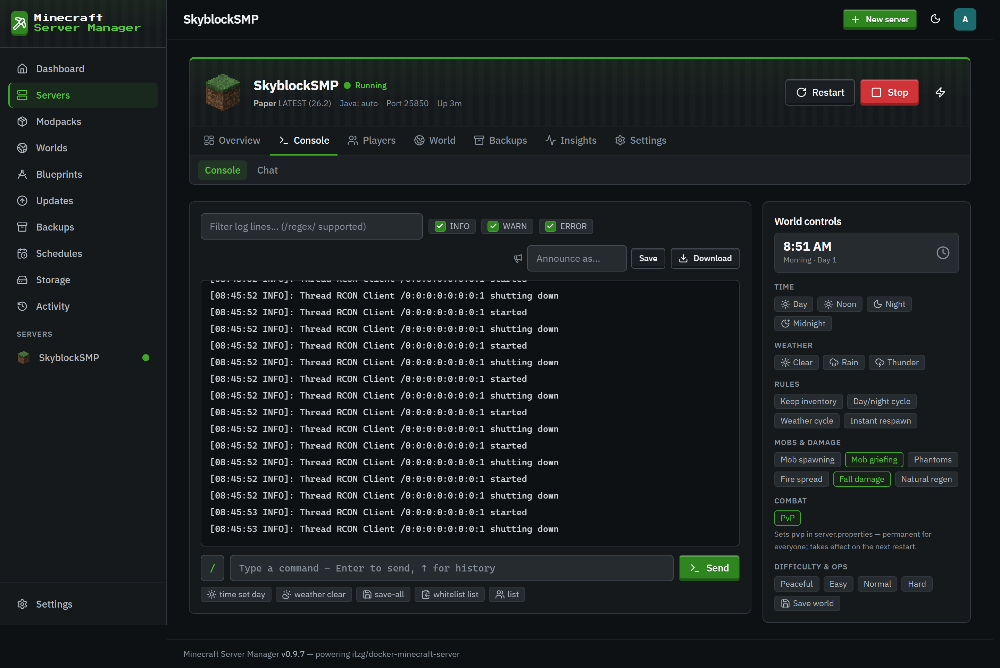
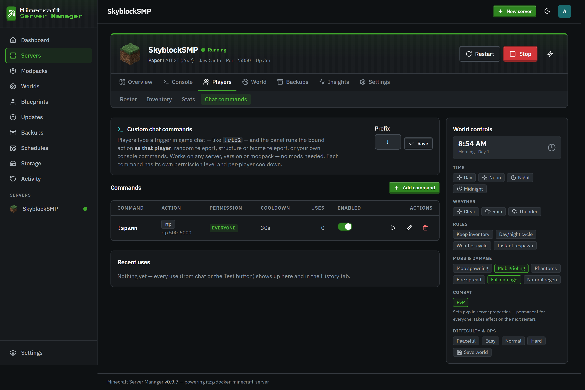

# Console & chat commands

[← Back to docs index](README.md)

## The live console

The **Console** tab streams the server log in real time and gives you a command box to send any server command - no `docker exec`, no SSH. Output comes back inline, colors and all.

The console is also where the panel reads the server's state: it watches the log to classify the boot phase ("Loading mods", "Generating world", "Finishing startup") and calls `list` to track who's online, so the dashboard and server cards always reflect reality.

That polling opens a short-lived RCON connection every cycle, which the server logs as a `Thread RCON Client … started` / `shutting down` pair every ~20 seconds, and (on servers whose core or plugins echo it) a `Rcon issued server command: …` line for each read-only poll - `list` for player counts, plus `time query …` and `gamerule <name>` reads while the World Controls page is open. The **Hide RCON noise** toggle above the log filters those lines out (along with the RCON listener startup lines). It's on by default and remembered per browser; turn it off to see the raw stream.

Commands sent from the panel can be announced in-game under a per-server label, so players know an operator acted rather than a mystery console.

## Chat commands

Chat commands let players trigger panel actions by typing a prefix command in game chat - for example `!spawn` to random-teleport. Detection is log-based and execution goes through the server, so **no mods are required**.

Each command has:

- A **trigger** (e.g. `spawn`) and a **prefix** (`!` by default).
- An **action**: random teleport, teleport to a structure, teleport to a biome, or run raw console commands.
- A **permission level**: everyone, whitelisted players, or operators only.
- A **cooldown**, and customizable pending / success / failure messages with placeholders like `{distance}`.

### A note on safety

Commands that can wreck a server - `stop`, `op`, `ban`, `whitelist`, and friends - are only allowed on **operator-only** triggers. The panel checks for these even when they're nested inside an `execute … run …` chain, so a low-permission trigger can't smuggle a dangerous command through. Ordinary chat text that merely mentions those words (like a `say` message) is left alone.
