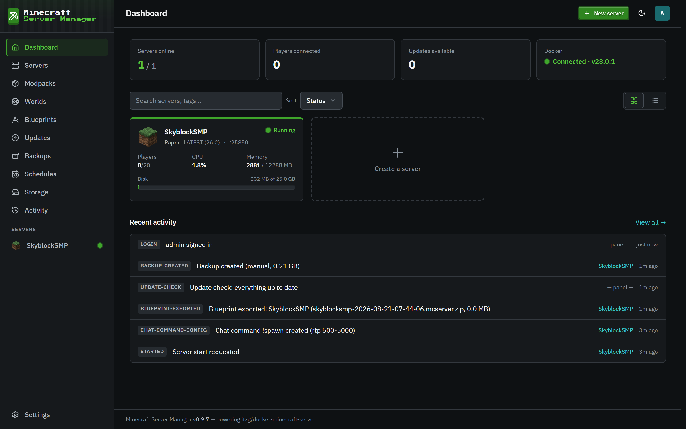

# The dashboard

[← Back to docs index](README.md)

The dashboard is your home base: every server, its live status, and a running feed of what's been happening.

## The summary tiles

Across the top:

- **Servers online**: how many of your servers are currently running.
- **Players connected**: the total player count across all running servers.
- **Updates available**: how many servers, packs, or mods have a newer version ([see Updates](updates.md)).
- **Docker**: whether the panel can reach the Docker daemon, and its version.

## Server cards

Each server shows as a card with its status (Running, Starting, Stopped, Crashed), the type and Minecraft version, and its game port. For running servers you also get live **players**, **CPU**, **memory**, and **disk** usage, updated continuously.

Every card also shows a **Last Backup** line ("3 days ago"). It switches to the warning color when the newest backup is more than 7 days old, or when a server more than a day old has never been backed up, so a server that is silently missing its backups stands out. A brand-new server gets a day of grace before it counts as never backed up.

Click a card to open that server. The empty **Create a server** card and the top-bar **Create a Server** button both start the [creation wizard](servers.md).

You can search and sort your servers, and switch between grid and list layouts with the toggle on the right.

## Recent activity

The feed at the bottom is a live, human-readable audit trail: logins, backups, blueprint exports, update checks, chat-command changes, server starts and stops, and more. Every entry is tagged with the server it belongs to (or the panel itself) and how long ago it happened. The full history lives on the [Activity](activity.md) page.

## Background tasks

Anything slow shows up in the **Background Tasks** menu in the top bar (the checklist icon), from any page: starting, stopping, restarting, and rebuilding servers, backups and their verification, restores, world imports and installs, mod and pack installs, blueprint exports and imports, update checks, and scheduled backups and update checks. The icon gets a spinning ring while something is running, with a count. Each row shows the current step and progress, and a toast tells you when a task you were watching finishes or fails. Finished tasks stay in the menu for a few seconds. Quick housekeeping jobs (temporary file cleanup, ban expiry sweeps) are left out so the menu stays quiet.
