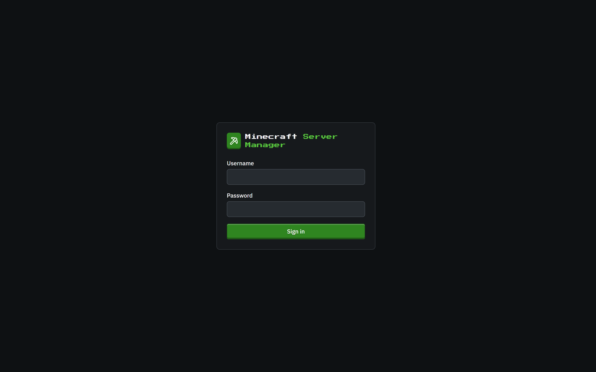

# Getting started

[← Back to docs index](README.md)

## First-run setup

The first time you open the panel, it asks you to create an administrator account. This is the only account that exists until you add more, and it has full control.

Pick a username and a password of at least 8 characters. That's it: you're signed in and taken straight to the dashboard.

> **Exposed installs are PIN-gated.** If you start the panel bound to a non-loopback address (`PANEL_HOST` other than `127.0.0.1`), the setup page also asks for a **6-digit PIN**. The panel prints it to its console on startup. Enter it along with your username and password. This stops a stranger who reaches the port first from claiming the admin account. The PIN disappears once the admin account exists.

## Signing in

After setup, the panel is protected by a login screen. Enter your username and password to continue.

If [two-factor authentication](two-factor-authentication.md) is enabled on your account, you'll be asked for a 6-digit code from your authenticator app right after your password.

## Finding your way around

Everything hangs off the left sidebar:

- **Dashboard**: every server at a glance ([details](dashboard.md)).
- **Servers**, **Modpacks**, **Worlds**, **Blueprints**: create and manage servers and their content.
- **Updates**, **Backups**, **Schedules**, **Storage**, **Activity**: the operational side: what's out of date, your snapshots, automation, disk usage, and the audit log.
- **Settings** (bottom): users, API keys, and panel configuration.

The top bar has the **Create a Server** button, a **theme toggle** (dark/light), and your **account menu**, where you can manage [two-factor authentication](two-factor-authentication.md) or sign out.

## On a phone or tablet

Every page is laid out for a narrow screen first and widens from there: the sidebar tucks away behind the menu button, data tables stack into cards, toolbars wrap, and the world-controls rail collapses to a card you open when you need it. Buttons and chips have a real touch target size. Nothing is desktop-only.

  
  
  
  
  
  

## What you need

The panel talks to Docker to run servers, so it needs access to a Docker daemon (Docker Desktop or a Docker Engine socket). When Docker is reachable, the dashboard's Docker tile shows **Connected** and its version. If it's not, the panel still runs. You just can't start servers until the daemon is up.

## Next steps

- [Create your first server →](servers.md)
- [Secure your account with 2FA →](two-factor-authentication.md)
