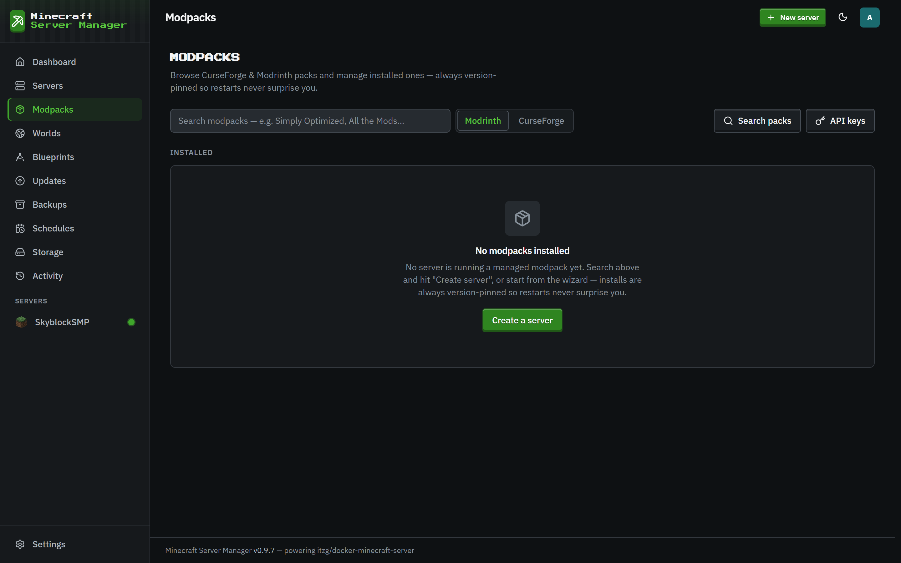

# Modpacks

[← Back to docs index](README.md)

The **Modpacks** page (and the **From modpack** tab in the [creation wizard](servers.md)) installs a modpack as a server, always **pinned to an exact pack version** so a restart can never silently upgrade the pack out from under you.

## Supported platforms

- **CurseForge**: search or paste a pack URL. Needs a CurseForge API key for search and private packs (add it under Settings → API keys).
- **Modrinth**: search by name.
- **FTB**: Feed The Beast packs.
- **GT New Horizons**: the 1.7.10 expert pack, installed from GTNH's own release index. GTNH picks its Java runtime per pack version (2.8.0+ runs on **Java 25** via bundled lwjgl3ify patches, older releases on Java 21 or 17), and the wizard raises the server's RAM and disk to sensible minimums for it.
- **Custom zip**: not a published pack at all: upload a **CurseForge modpack export** (the zip with `manifest.json` that CurseForge's app produces for a hand-picked mod set) or **any zip of mod jars**. The panel resolves the manifest in bulk via the CurseForge API (or identifies each jar by hash/fingerprint/metadata), previews what fits, and installs everything in one task, including the pack's `overrides/` configs if you opt in. Mods whose authors disallow automated downloads are listed with a browser link and a manual-upload slot instead of failing the install.

## How pinning works

When you pick a pack, the panel resolves the exact version, records it, and installs that. On the **Updates** page you'll be told when a newer version is available; upgrading is a deliberate, guarded action with a pre-update backup and rollback. Stable-tracking servers are never offered a beta. A server's own **Versions** tab answers the other half of the question: which future Minecraft versions the mods it actually has can follow ([updates](updates.md#minecraft-version-compatibility)).

Servers created on very old panel versions (before 0.9.7) could be left _unpinned_, meaning the container image would quietly install the newest pack version on every start. The panel now repairs these at boot: it locks each one to the version that is actually installed (read from the panel's own records or the image's install manifest, never a freshly resolved "latest") and logs an event. If it can't tell what's installed, the server's Settings page shows a warning asking you to pick the version manually, and any attempt to save an unpinned modpack configuration is rejected outright.

## Update policy

Each server has an update policy in **Settings**, and all three options mean what they say:

- **Manual only**: nothing ever changes on its own, and the server is left out of the update badge and Updates page entirely. The "leave me alone" mode: ideal for a hand-tuned or imported pack you never want touched.
- **Notify me** (default): the daily check surfaces available updates as a badge and on the Updates page; applying them is always your click.
- **Auto-update**: after the scheduled daily check, pending **pack** updates are applied through the same guarded path as a manual upgrade: pre-update backup, health monitoring, and an automatic rollback if the new version fails to boot. Updates that would move the server to a different Minecraft version are always skipped with an event instead: converting a world permanently is a decision the panel refuses to make for you. The manual "check now" buttons only check; they never trigger auto-updates.

## Upgrading a pack

From a pinned server you can upgrade to a newer version in one action. The panel takes a backup first, swaps the pinned version, rebuilds the container (re-resolving Java if the new version needs a different runtime), and monitors the first boot, with a generous window for large packs like GTNH that download a couple of gigabytes and build a several-hundred-mod world on first start.
