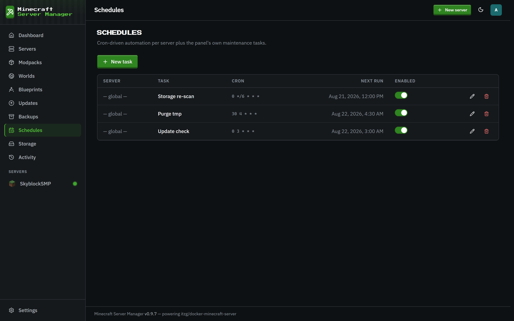

# Schedules

[← Back to docs index](README.md)

The **Schedules** page automates recurring tasks with cron expressions. No external cron, no scripts.

## What you can schedule

- **Restarts**: a nightly restart to keep a long-running server healthy.
- **Backups**: regular snapshots (tagged `scheduled` on the [Backups](backups.md) page).
- **Commands**: run any server command on a schedule.
- **Update checks**: periodically refresh what's out of date.

Each schedule targets a specific server (or the panel globally), runs on its own cron expression, and can be enabled or disabled without deleting it. The last run time is shown so you can confirm it's firing.
