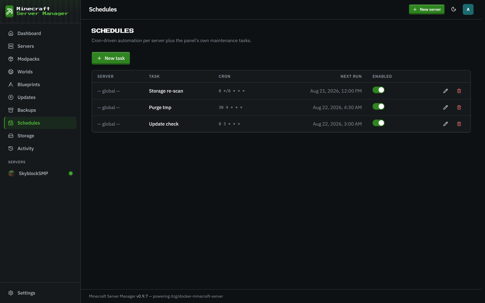

# Schedules

[← Back to docs index](README.md)

The **Schedules** page automates recurring tasks with cron expressions. No external cron, no scripts.

## What you can schedule

- **Restarts**: a nightly restart to keep a long-running server healthy.
- **Backups**: regular snapshots (tagged `scheduled` on the [Backups](backups.md) page).
- **Commands**: run any server command on a schedule.
- **Update checks**: periodically refresh what's out of date.
- **Back up all servers**: one schedule that backs up every server in turn, skipping stopped servers that are already backed up.
- **Restart all running servers**: one schedule that restarts every running server in turn. Servers that are still starting up or stopped are left alone.

Each schedule targets a specific server (or the panel globally), runs on its own cron expression, and can be enabled or disabled without deleting it. The last run time is shown so you can confirm it's firing.

The two "all servers" tasks are admin-only, because a per-server permission cannot cover every server. Each server is handled on its own, so one failure does not stop the rest; if any server fails, the run is recorded as failed in the activity log, and the panel log names the servers that failed.
