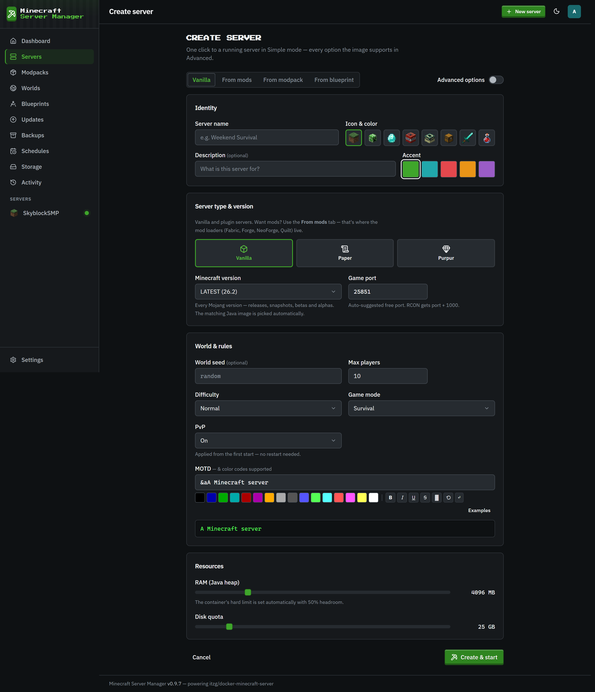
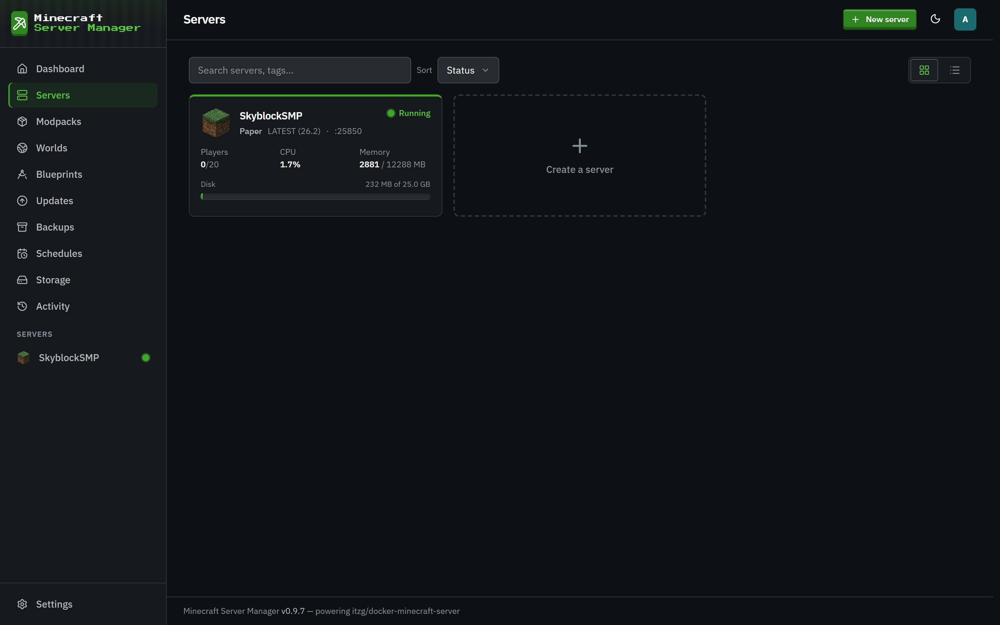
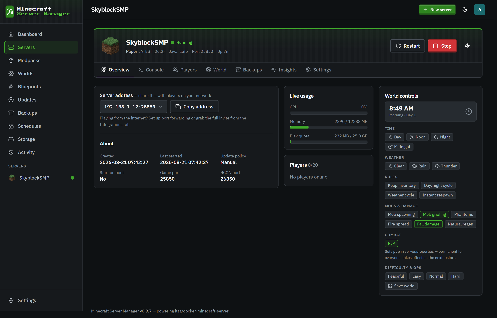
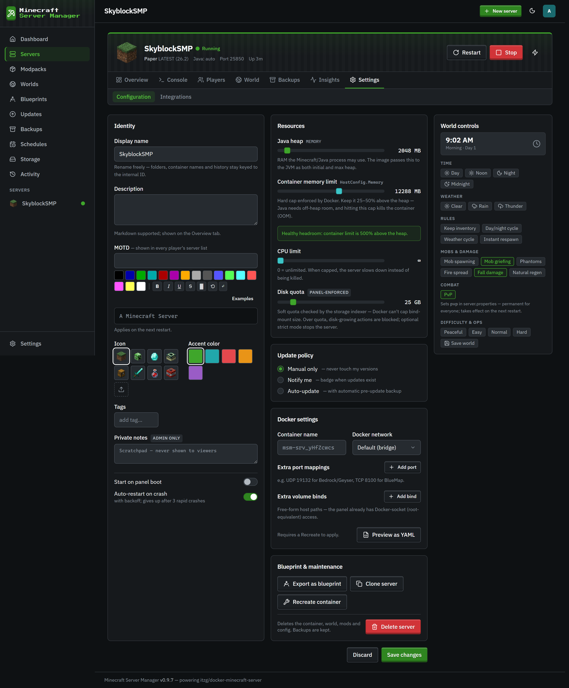
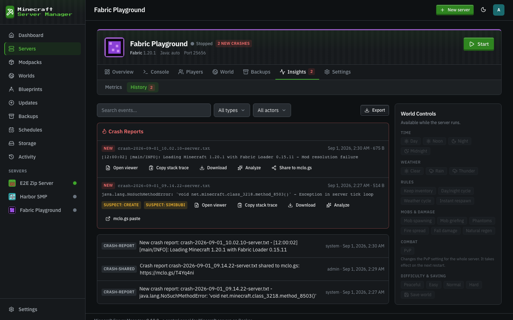
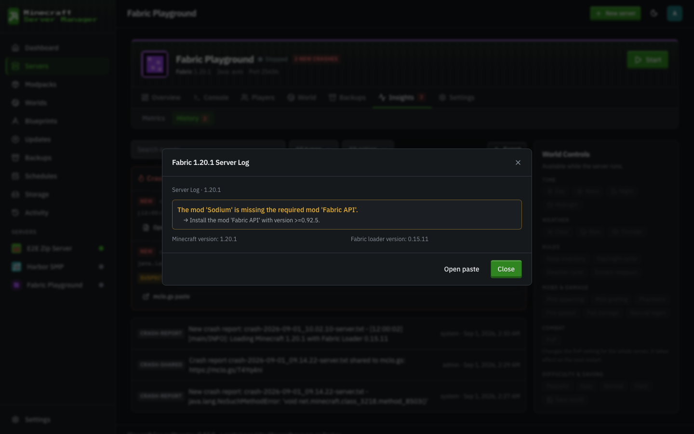

# Creating & managing servers

[← Back to docs index](README.md)

## Creating a server

Click **Create a Server** (top bar) or the **Create a server** card to open the wizard.

The wizard pre-fills memory, CPU, and disk-quota fields from **Defaults for new servers** on the Settings page, which an admin can change at any time.

You choose:

- A **name** (and optional icon, accent color, and tags to organize your fleet).
- A **server type** - vanilla, Paper, Fabric, Forge, NeoForge, and more, each mapped to the right itzg image behind the scenes.
- A **Minecraft version** - `LATEST`, a snapshot, or a specific version.
- **Resources** - RAM (heap), container memory limit, CPU, and a disk quota.

Prefer a modpack? The **From modpack** tab installs a CurseForge, Modrinth, FTB, or GT New Horizons pack instead (see [Modpacks](modpacks.md)), or takes a **custom zip you upload**: a CurseForge modpack export (`manifest.json`) or any zip of mod jars. The manifest (or a majority vote across the identified jars) fills in the loader and Minecraft version, and every mod installs in one task. You can also start from a saved [Blueprint](blueprints.md).

The panel picks a sensible Java runtime for your version automatically, pulls the image, creates the container, and (optionally) starts it, all from the one form.

## The servers list

The **Servers** page lists your whole fleet with status and quick stats.

## A single server

Opening a server gives you a tabbed workspace:

- **Overview** - status, live stats, uptime, and the primary start / stop / restart controls.
- **Console** - the live log stream and command input, plus in-game chat ([details](console-and-chat.md)).
- **Players** - who's online, plus inventory, statistics, and [chat commands](console-and-chat.md).
- **Mods** - the installed mod list, the [mod browser](modpacks.md), and content updates.
- **World** - [worlds, the live map, and the file manager](worlds-and-files.md).
- **Backups** - [snapshots and restore](backups.md) for this server.
- **Monitoring** - per-server history and live metrics, including crash reports (see below).
- **Settings** - everything about how the server runs, plus the [integrations](integrations.md) (Discord, status page, invites, chatbot).

The **World Controls** rail rides along on every tab: the in-game clock, weather, the common gamerules as toggle chips, and "Show all world rules" for the rest.

**Monitoring → Metrics** shows the live CPU, memory, network, and TPS charts with a selector between the real-time view and the saved 1h / 24h / 7d history, plus a health and stability card with the last 24 h / 7 d of crashes and restarts, and per-world sizes.

## Server settings

The **Settings** tab is the full configuration surface: rename, resources, update policy, auto-start / auto-restart, environment variables, and advanced Docker overrides. Fields that change how the container runs are clearly marked as needing a restart.

**About the memory meter.** "RAM (Java heap)" is handed to Java as both its starting and its maximum heap, and Java fills a heap it was given up front within the first minute, with or without the Aikar / MeowIce flag presets. So the memory meter settles at about the heap size and stays there even when nobody is playing; the tick on the meter marks where the heap sits under the container limit, and the note under it says so. If you would rather see memory follow real use, set a smaller **Initial heap** (advanced): on a 2 GB heap that brought idle use from 2.6 GB to about 1.3 GB in our measurements. Java also needs memory outside the heap (about 0.5 GB on vanilla, 1.5 to 2 GB on a large modpack), which is what the container limit's headroom is for. See the README's "Two memory limits" for the numbers.

> Advanced Docker override fields (custom container name, extra port and bind mounts, and raw overrides) are **admin-only**, because a bind mount plus the panel's Docker access is effectively root on the host. See [Users & roles](users-and-roles.md).

## Crash reports & mclo.gs analysis

Crash reports (`crash-reports/*.txt` and JVM `hs_err_pid*.log` files) are picked up automatically, parsed into a one-line summary with the exception and suspected mods, and listed under **Monitoring → History**:

Each report card offers a built-in viewer (with collapsible sections and highlighted exceptions), copy-stack-trace, and download, plus two [mclo.gs](https://mclo.gs) actions:

- **Share to mclo.gs** publishes the report as a public paste and copies the link - the exact thing mod authors and support Discords ask for. The link is remembered on the report, so nothing is ever uploaded twice.
- **Analyze** runs mclo.gs's automated insights over the paste: known problems with suggested fixes (missing dependencies, version mismatches, common mod conflicts), rendered right in the panel.

Both actions sit behind an explicit confirmation, because a paste is public: crash reports can include player names and your full mod list. The panel never uploads anything on its own.
