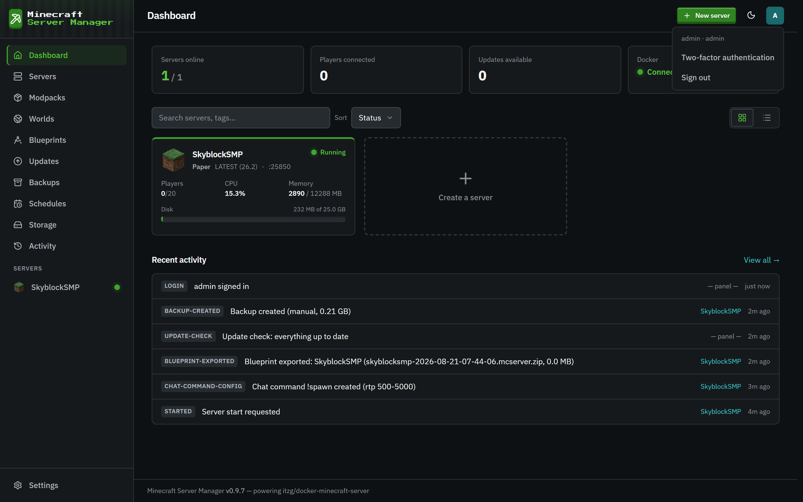
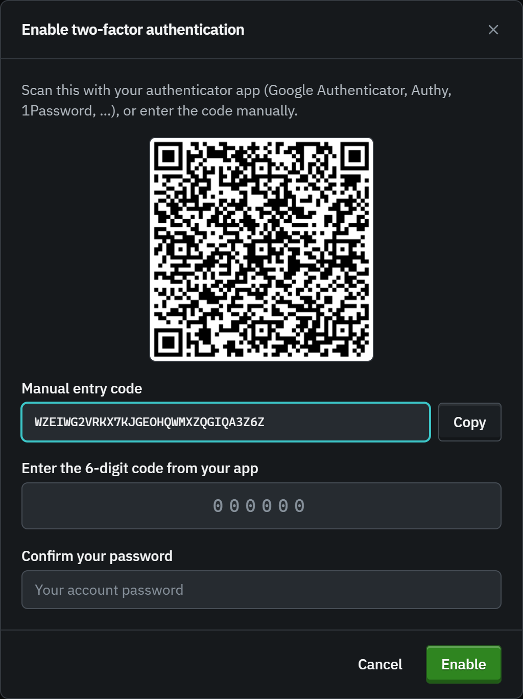
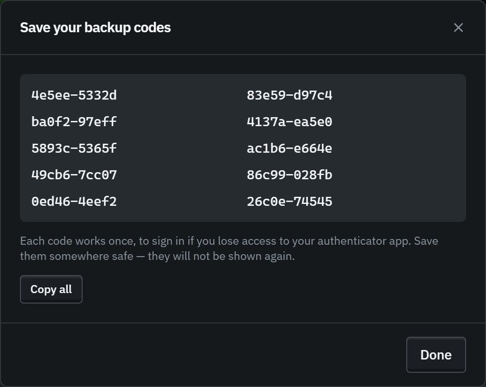
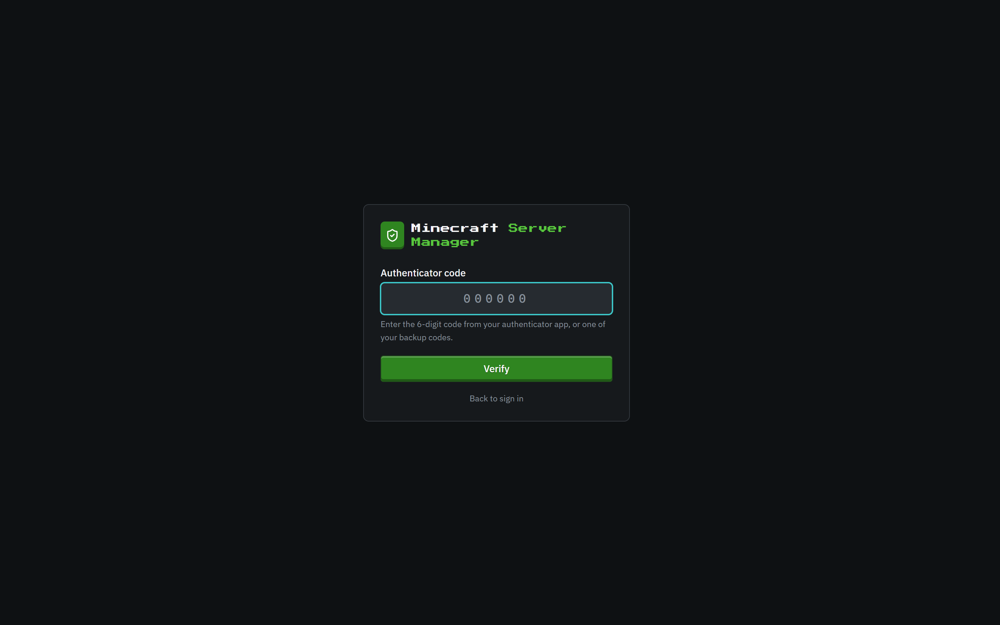

# Two-factor authentication

[← Back to docs index](README.md)

Two-factor authentication (2FA) adds a second step to signing in: after your password, you enter a short code from an authenticator app on your phone. Even if someone learns your password, they can't get in without your device.

It works with any standard TOTP authenticator (Google Authenticator, Authy, 1Password, Microsoft Authenticator, and others), and it's available to **every** account, not just admins. Protecting your own login isn't a server-management action, so viewers and operators can enable it too.

## Enabling 2FA

Open the account menu (your initial, top-right) and choose **Two-factor authentication**.

You'll get an enrollment dialog:

1. **Scan the QR code** with your authenticator app, or tap **Copy** and enter the manual key by hand.
2. Type the **6-digit code** your app now shows.
3. **Confirm your password.** Enabling 2FA re-checks your password, so a stray open session can't turn it on with someone else's device.
4. Click **Enable**.

### Save your backup codes

The moment 2FA is enabled, the panel shows a set of one-time **backup codes**.

Each code works **once**, to sign in if you ever lose access to your authenticator app. Save them somewhere safe (a password manager is ideal) because they won't be shown again. You can regenerate a fresh set any time (which invalidates the old ones).

## Signing in with 2FA

From then on, signing in has a second step. After your username and password, the panel asks for your code:

Enter the current 6-digit code from your app (or one of your backup codes) and you're in. Until you complete this step, the session is **not** signed in: it can't reach any page or API.

## Managing or turning off 2FA

Open the same **Two-factor authentication** entry in the account menu while it's enabled. After confirming your password you can:

- **Regenerate backup codes**: issues a new set and retires the old.
- **Disable 2FA**: removes it from your account.

Both re-check your current password first.

## Lost your phone _and_ your backup codes?

An **admin** can reset another user's 2FA from **Settings → Users** (the **Reset** button in the 2FA column). That clears 2FA for the account so the user can sign in with just their password and set it up fresh. Admins can't password-lessly reset their _own_ 2FA. They go through the normal password-gated disable, so a hijacked admin session can't strip its own second factor.

## Good to know

- Codes are time-based and rotate every 30 seconds; the panel accepts a small clock drift, and quietly recovers if the server's clock is later corrected.
- A code can't be replayed: once it's used to sign in, that same code won't work again within its window.
- Wrong codes are rate-limited. The limiter is **shared** with the password step (a per-account lockout plus a per-IP `RATE_LIMIT_AUTH_PER_15MIN` limiter), so entering a correct password can't reset the counter right before guessing the 6-digit code.
- 2FA changes (enable, disable, reset, backup-code use) are all recorded in the [Activity log](activity.md).
