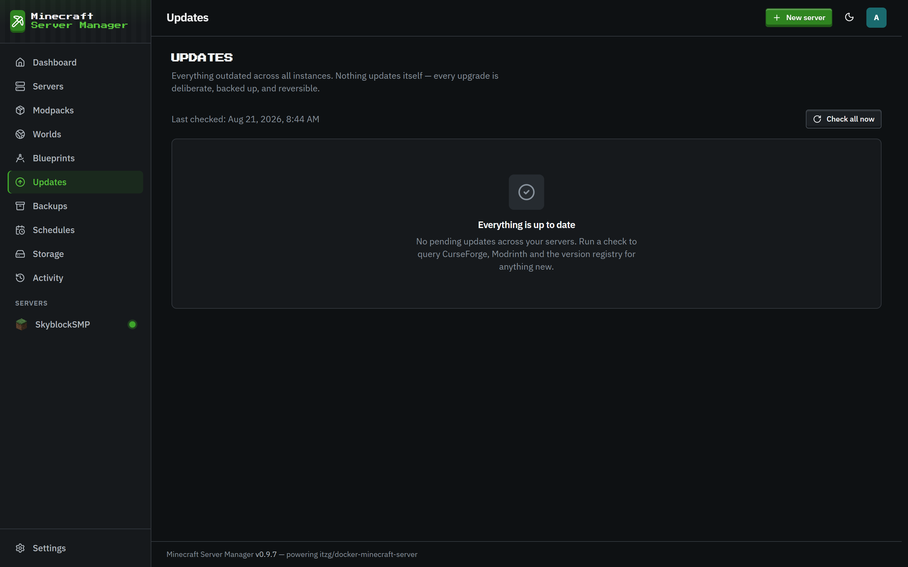

# Updates

[← Back to docs index](README.md)

The **Updates** page tracks what's out of date across your fleet in one place:

- **Modpack** versions ([modpacks](modpacks.md)) against Modrinth / CurseForge / the GTNH release index.
- **Custom content** you added yourself - mods, datapacks, resource packs, plugins - each against its source: Modrinth, CurseForge, Hangar, SpigotMC (Spiget), or GitHub Releases. GitHub lookups use ETag revalidation, so daily checks barely touch its rate limit.
- **Docker image** staleness: each running container's image ID against a freshly pulled tag (deduplicated across servers on the same tag), offered as a recreate-only upgrade.
- **Standalone version pins**: for a server with no managed pack, an explicit `mc_version` pin against Mojang's manifest, and an explicit loader-build env var (`PAPER_BUILD`, `FORGE_VERSION`, and the like) against the loader's registry. Paper builds come from PaperMC's current **Fill v3 API** (the legacy v2 endpoint stopped receiving new Minecraft versions).

## How it works

The panel checks each server's pinned versions against the upstream source and lists anything with a newer release. A matching count also appears on the [dashboard](dashboard.md)'s "Updates available" tile.

Checks run on demand and can be scheduled ([Schedules](schedules.md)). Update **policy** is per-server - you decide whether the panel just notifies you, or leaves everything manual.

## Applying an update

Updates are never silent. When you choose to upgrade a pack, the panel:

1. Takes a **pre-update backup** (so it's reversible - the last 10 pre-update backups per server are kept).
2. Re-pins the exact new version.
3. Recreates the container, re-resolving the Java runtime if needed.
4. Monitors the first boot, with a per-platform time budget.

If it doesn't come up healthy, you roll back to the pre-update backup. A stable-tracking server is never offered a beta, and the changelog link points at the real per-version diff where the source provides one. A failed update also fires a Discord [alert](integrations.md) if the integration is configured.
