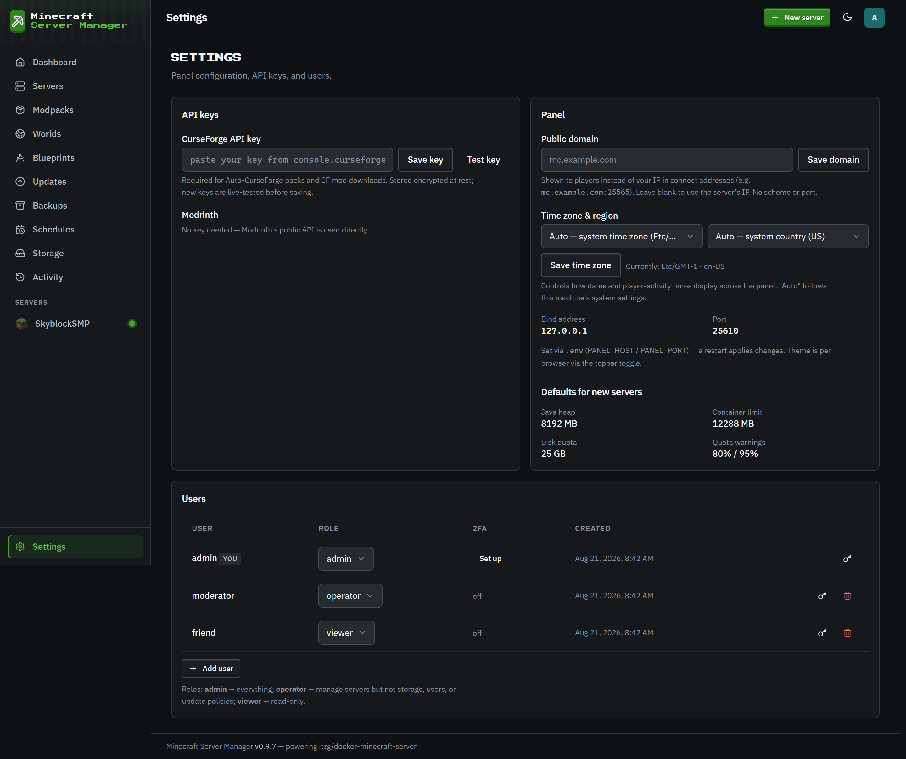

# Users & roles

[← Back to docs index](README.md)

The panel is multi-user. Manage accounts under **Settings → Users**.

## The three roles

| Role         | Can do                                                                                                           |
| ------------ | ---------------------------------------------------------------------------------------------------------------- |
| **admin**    | Everything: manage users, API keys, global files, advanced Docker overrides, and every server action.            |
| **operator** | Run and configure servers (start/stop, console, backups, worlds, mods, most settings), but not admin-only areas. |
| **viewer**   | Read-only. See servers and their status, but make no changes.                                                    |

Every user - including a viewer - can manage their own [two-factor authentication](two-factor-authentication.md), because protecting your own login isn't a server-management action.

## Admin-only, and why

A few things are restricted to admins on purpose:

- **User management, API keys, and global files.**
- **The [public API](public-api.md)** - enabling `/api/v1` and creating, scoping, or revoking its read-only Bearer tokens.
- **Advanced Docker overrides** - custom container name, extra port publishes, and bind mounts. A bind mount can map any host path into a container, and combined with the panel's Docker access that's effectively root on the host. These fields only appear for admins.

Custom container names also can't live in the panel's own `msm-` namespace, so a hand-named container can never shadow another server's and misdirect a stop or command to the wrong instance.

## Managing accounts

Admins can create users, change roles, reset passwords, and delete accounts from the Users table. The **2FA** column shows whether each user has two-factor enabled; an admin can **reset** another user's 2FA (for the lost-phone-and-backup-codes case) - but never disable their own without their password, which the self-service flow handles instead.

Failed logins are rate-limited per account (both a per-IP and an account-global counter) to slow down brute-force attempts, and the same limit covers the 2FA code step so a correct password can't reset the counter before code-guessing. In front of that sits a coarser per-client-IP request limiter on the login / 2FA / setup endpoints, tunable via `RATE_LIMIT_AUTH_PER_15MIN` (default 100; behind a reverse proxy, set `TRUST_PROXY` so it keys on the real client IP).
