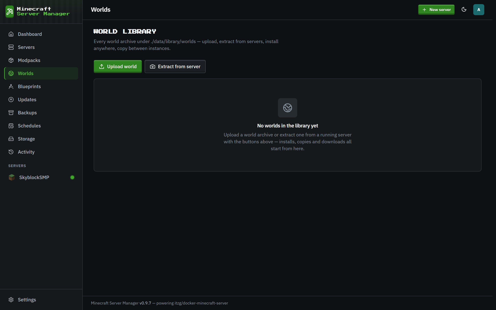
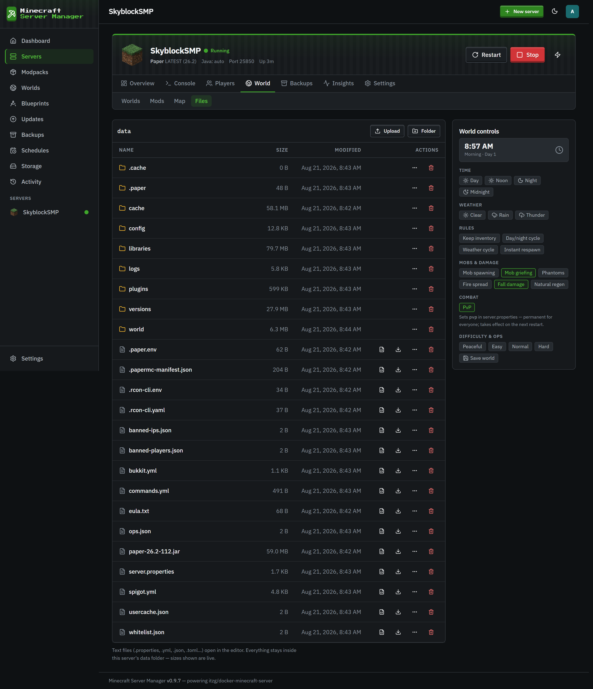
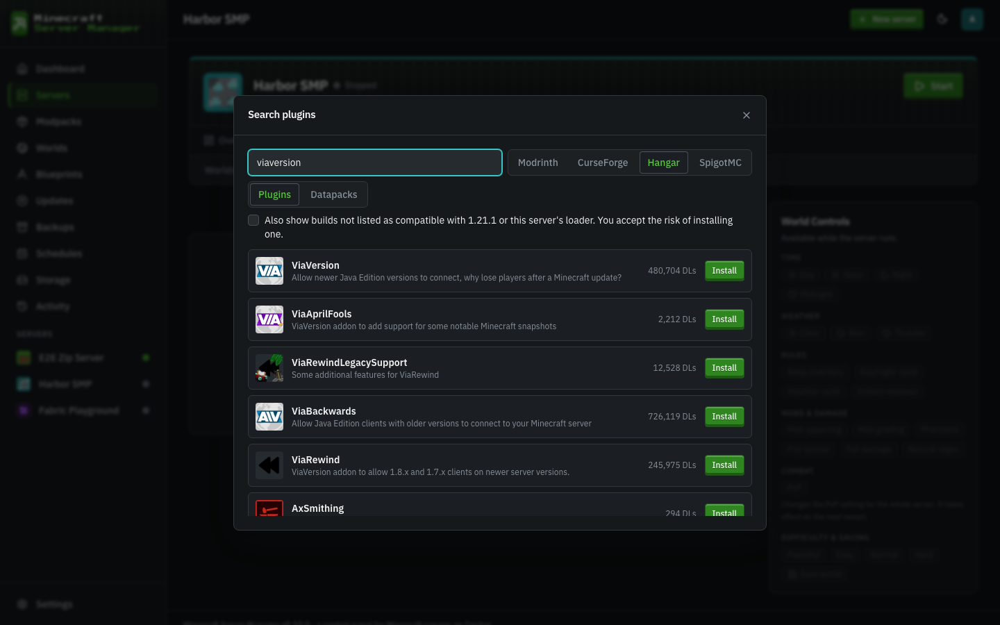
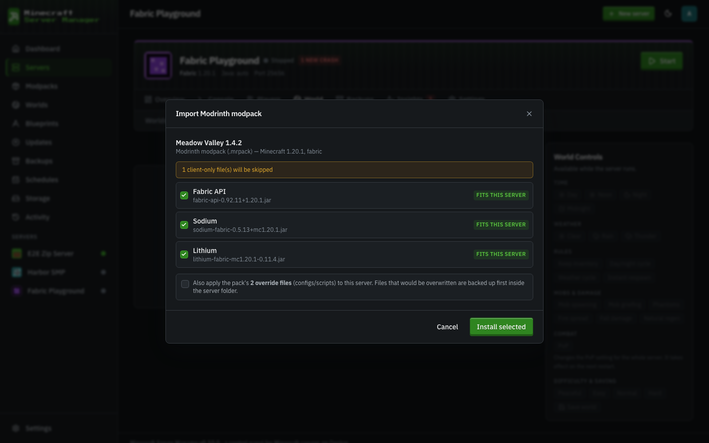
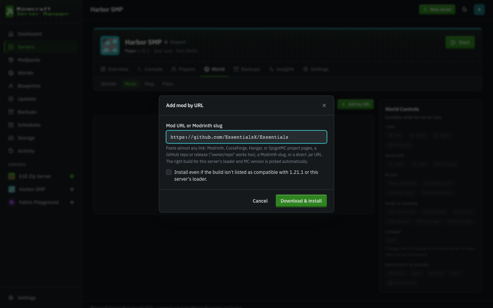

# Worlds & files

[← Back to docs index](README.md)

## Worlds

The **Worlds** page manages the world data across your servers - swap the active world, upload a world, or download one.

## The file manager

Under a server's **World** section, the **Files** tab is a full in-browser file manager for that server's data directory. List, read, edit, create, rename, move, copy, delete, and upload files - everything you'd normally do over SSH, from the browser.

Text files open in an editor with a 2 MB limit; larger files can be downloaded. Uploads accept multiple files at once.

### Staying inside the sandbox

Every file operation is confined to the server's own data directory. The panel resolves each path and refuses anything that would escape - `..` traversal, absolute paths, and even symlinks that point outside the directory (including dangling ones that don't exist yet). A mod or plugin can't plant a link to trick the file manager into reading or writing elsewhere on the host.

## Mods

For modded servers, the **Mods** tab (also under **World**) manages the mod set - browse and add mods, and see what's installed. Mod and pack updates surface on the [Updates](updates.md) page.

### Adding mods

Four ways in, all from the Mods tab toolbar:

- **Search mods** - search **Modrinth or CurseForge** (the CurseForge chip appears once an [API key](settings.md) is stored), and on plugin servers also **Hangar** (PaperMC's own plugin registry) and **SpigotMC** (via Spiget's CDN proxy) - both keyless. Everything is filtered to the server's loader and Minecraft version; Quilt servers automatically see fabric-tagged builds too, since Quilt runs Fabric mods. Results already on the server show an **Installed** badge. If a CurseForge author disallows automated downloads - or a SpigotMC resource is hosted off-site - the panel says so up front and offers an **Open page** + **Upload jar** path instead of failing mid-install.

  

- **Import zip** - one button, three shapes, auto-detected:
  - A **Modrinth modpack (`.mrpack`)**: every pinned file is canonicalized back into its Modrinth project via hash lookup (so imported mods keep real names, icons, and stay update-checkable; files Modrinth doesn't know install from the pack's own URL), verified against the pack's sha512 checksums while downloading, and previewed with fit verdicts. Client-only files are skipped visibly, and both override trees (`overrides/`, then `server-overrides/` - the server-specific copy wins) can be applied.

    

  - A **CurseForge modpack export** (the zip CurseForge's app produces, with `manifest.json`): every pinned mod is resolved in bulk, previewed with warnings (wrong loader/MC for this server, files no longer on CurseForge, mods that need a manual download), and installed with real progress. The pack's `overrides/` (configs, scripts) can optionally be applied too - any file that would be overwritten is backed up first into `.import-backups/<timestamp>/` inside the server folder.
  - A **plain zip of jars** you collected yourself: each jar is identified (Modrinth hash match → CurseForge fingerprint → the jar's own metadata) and judged against the server - _fits / wrong loader / wrong MC version / already installed / unidentified_ - so you pick what actually belongs before anything installs.
- **Add by link** - paste almost anything: Modrinth, CurseForge, Hangar, or SpigotMC project pages, a GitHub repo or release URL (a bare `owner/repo` works too - GitHub installs prefer the newest stable release and skip `-sources`/`-javadoc` sidecar jars), a bare Modrinth slug, or any direct `.jar` URL. The panel resolves the right build for the server's loader and MC version.

  

- **Upload jar** (from the search fallback or the pending-downloads resolver) - uploaded jars are identified the same way, so they keep their real name, version, icon, and become update-checkable.

Every registry install is **checksum-verified while it downloads**: the stream is checked against the strongest digest the registry publishes (sha512 → sha256 → sha1 → md5) and a mismatch aborts before anything lands on the server.

A whole zip - `.mrpack` included - can also **create a server**: in the wizard's _From modpack_ tab, upload it and the pack manifest (or a majority vote across the identified jars) fills in the loader, Minecraft version, and loader build.
